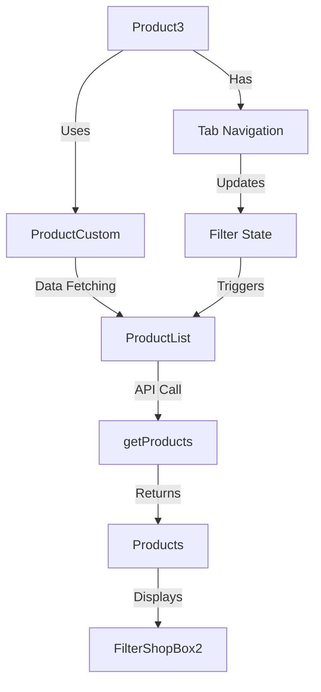

# Product Section Implementation Guide - NIC-Next

## Table of Contents
1. [Component Control Flow](#component-control-flow)
2. [Creating New Sections](#creating-new-sections)
3. [Core Components Used](#core-components-used)
4. [API Integration](#api-integration)
5. [Best Practices](#best-practices)

## Component Control Flow

### 1. Product3 Component Flow


#### Code Structure:
1. **Product3.js**
```javascript
export default function Product3() {
    const [activeIndex, setActiveIndex] = useState(1)
    
    // Filter logic based on tabs
    const getFilter = () => {
        switch(activeIndex) {
            case 1: return {}                           // All Products
            case 2: return { is_popular: true }         // Popular
            case 3: return { sale_price: { $exists: true } }  // On Sale
            case 4: return { rating: { $gte: 4 } }     // Best Rated
        }
    }
    
    return (
        <ProductList 
            filter={getFilter()}
            displayType="carousel"
            showTabs={true}
        />
    )
}
```

The ProductCustom component is our base component for creating any product section. It handles:
- Product filtering
- Display layout (grid/carousel)
- Loading states
- Error handling
- Pagination

### Basic Template
```javascript
import ProductCustom from "../layout/ProductCustom"

export default function NewProductSection() {
    return (
        <ProductCustom 
            title="Your Section Title"
            filter={{ /* your filters */ }}
            displayType="grid"  // or "carousel"
            showTabs={false}    // or true for tab filtering
            className="your-custom-class"
            itemLimit={10}      // number of items to show
        />
    )
}
```

## Filter Types

### 1. Category Filter
For category-specific product sections:
```javascript
// Single Category
<ProductCustom 
    title="Fashion Products"
    filter={{ category: "categoryId" }}
    displayType="grid"
/>

// Multiple Categories
<ProductCustom 
    title="Fashion & Electronics"
    filter={{ category: ["categoryId1", "categoryId2"] }}
    displayType="grid"
/>
```

### 2. Feature Filters
For products with specific features:
```javascript
// Featured Products
<ProductCustom 
    title="Featured Products"
    filter={{ is_featured: true }}
    displayType="carousel"
/>

// Popular Products
<ProductCustom 
    title="Popular Products"
    filter={{ is_popular: true }}
    displayType="carousel"
/>

// Trending Products
<ProductCustom 
    title="Trending Products"
    filter={{ is_trending: true }}
    displayType="carousel"
/>
```

### 3. Combined Filters
You can combine different filters:
```javascript
// Featured Products in a specific category
<ProductCustom 
    title="Featured Fashion"
    filter={{ 
        category: "categoryId",
        is_featured: true 
    }}
    displayType="carousel"
/>
```

## Display Options

### 1. Grid Display
Best for category pages or large collections:
```javascript
<ProductCustom 
    displayType="grid"
    className="product-grid-section"
/>
```

### 2. Carousel Display
Best for featured sections or limited space:
```javascript
<ProductCustom 
    displayType="carousel"
    className="product-carousel-section"
/>
```

## Examples

### 1. Featured Products Section
```javascript
export default function FeaturedProducts() {
    return (
        <ProductCustom 
            title="Featured Products"
            filter={{ is_featured: true }}
            displayType="carousel"
            showTabs={true}
            className="featured-products-section pt-65"
            itemLimit={8}
        />
    )
}
```

### 2. Category Products Section
```javascript
export default function CategoryProducts({ categoryId, categoryName }) {
    return (
        <ProductCustom 
            title={categoryName}
            filter={{ category: categoryId }}
            displayType="grid"
            showTabs={false}
            itemLimit={15}
        />
    )
}
```

### 3. Mixed Filter Section
```javascript
export default function TrendingFashion() {
    return (
        <ProductCustom 
            title="Trending in Fashion"
            filter={{ 
                category: "fashion-category-id",
                is_trending: true 
            }}
            displayType="carousel"
            showTabs={false}
            itemLimit={10}
        />
    )
}
```

## Best Practices

1. **Naming Convention**
   - Use descriptive names for your section components
   - End with 'Section' or 'Products' for clarity

2. **Filter Usage**
   - Use single filters for simple sections
   - Combine filters when needed but keep it minimal
   - Always test filter combinations

3. **Display Type Selection**
   - Use carousel for featured/highlight sections
   - Use grid for category/search results
   - Consider mobile responsiveness

4. **Performance**
   - Set appropriate itemLimit
   - Use lazy loading when available
   - Consider pagination for grid displays

5. **Error Handling**
   - ProductCustom handles basic errors
   - Add custom error UI if needed
   - Log errors for debugging

## Quick Reference

### Common Filters
```javascript
// Featured Products
filter={{ is_featured: true }}

// Popular Products
filter={{ is_popular: true }}

// Trending Products
filter={{ is_trending: true }}

// Category Products
filter={{ category: "categoryId" }}

// Sale Products
filter={{ sale_price: { $exists: true } }}
```

### Display Types
```javascript
// Grid Display
displayType="grid"

// Carousel Display
displayType="carousel"
```

Remember: The ProductCustom component is designed to be flexible and reusable. You can create multiple product sections with different configurations while maintaining consistent behavior and appearance across your application.
